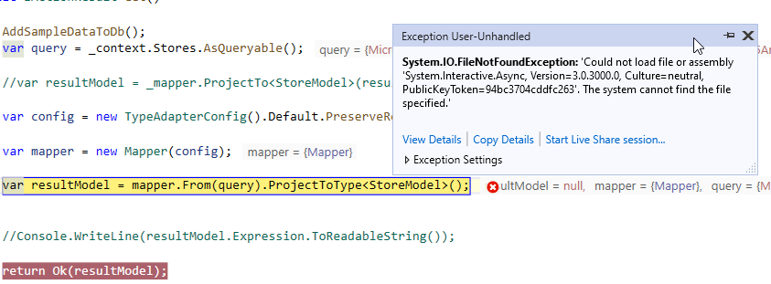

# how to use this repo

1. update `appsettings.json` for a proper connection string

1. run this command: `dotnet ef database update`

1. run the application

1. use any of below links

   - in `StoresProjectedController.cs` using Mapster for projection to `IQueryable`. it throws error.

     > GET http://localhost:63273/odata/StoresProjected?$select=Id&$expand=owner($select=id) HTTP/1.1

   - in `StoresSimpleController.cs` converting dbset directly and converting it to `IQueryable` and it works just fine
     > GET http://localhost:63273/odata/StoresSimple?$select=Id&$expand=owner($select=id) HTTP/1.1

# stacktrace



```

System.IO.FileNotFoundException: Could not load file or assembly 'System.Interactive.Async, Version=3.0.3000.0, Culture=neutral, PublicKeyToken=94bc3704cddfc263'. The system cannot find the file specified.
File name: 'System.Interactive.Async, Version=3.0.3000.0, Culture=neutral, PublicKeyToken=94bc3704cddfc263'
   at Mapster.TypeAdapterBuilderExtensions.ProjectToType[TDestination](IAdapterBuilder`1 source)
   at Research.Dotnet5AndOdata.Controllers.StoresProjectedController.Get() in C:\repo\forking\ef-int32-bug\src\Axceligent.Research.Dotnet5AndOdata\Controllers\StoresProjectedController.cs:line 47
   at lambda_method12(Closure , Object , Object[] )
   at Microsoft.AspNetCore.Mvc.Infrastructure.ActionMethodExecutor.SyncActionResultExecutor.Execute(IActionResultTypeMapper mapper, ObjectMethodExecutor executor, Object controller, Object[] arguments)
   at Microsoft.AspNetCore.Mvc.Infrastructure.ControllerActionInvoker.InvokeActionMethodAsync()
   at Microsoft.AspNetCore.Mvc.Infrastructure.ControllerActionInvoker.Next(State& next, Scope& scope, Object& state, Boolean& isCompleted)
   at Microsoft.AspNetCore.Mvc.Infrastructure.ControllerActionInvoker.InvokeNextActionFilterAsync()
--- End of stack trace from previous location ---
   at Microsoft.AspNetCore.Mvc.Infrastructure.ControllerActionInvoker.Rethrow(ActionExecutedContextSealed context)
   at Microsoft.AspNetCore.Mvc.Infrastructure.ControllerActionInvoker.Next(State& next, Scope& scope, Object& state, Boolean& isCompleted)
   at Microsoft.AspNetCore.Mvc.Infrastructure.ControllerActionInvoker.InvokeInnerFilterAsync()
--- End of stack trace from previous location ---
   at Microsoft.AspNetCore.Mvc.Infrastructure.ResourceInvoker.<InvokeFilterPipelineAsync>g__Awaited|19_0(ResourceInvoker invoker, Task lastTask, State next, Scope scope, Object state, Boolean isCompleted)
   at Microsoft.AspNetCore.Mvc.Infrastructure.ResourceInvoker.<InvokeAsync>g__Awaited|17_0(ResourceInvoker invoker, Task task, IDisposable scope)
   at Microsoft.AspNetCore.Routing.EndpointMiddleware.<Invoke>g__AwaitRequestTask|6_0(Endpoint endpoint, Task requestTask, ILogger logger)
   at Microsoft.AspNetCore.Authorization.AuthorizationMiddleware.Invoke(HttpContext context)
   at Microsoft.AspNetCore.Diagnostics.DeveloperExceptionPageMiddleware.Invoke(HttpContext context)
```
