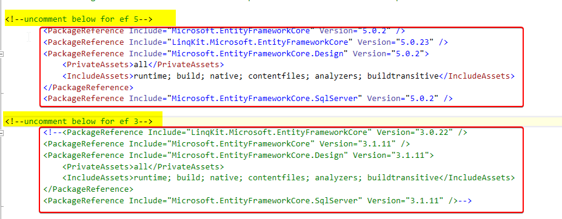

# how to use this repo

1. update `appsettings.json` for a proper connection string

1. run this command: `dotnet ef database update`

1. run the application

1. use any of below links

   - in `StoresProjectedController.cs` using automapper for projection to `IQueryable`. it throws error.

     > GET http://localhost:63273/odata/StoresProjected?$select=Id&$expand=owner($select=id) HTTP/1.1

   - in `StoresSimpleController.cs` converting dbset directly and converting it to `IQueryable` and it works just fine
     > GET http://localhost:63273/odata/StoresSimple?$select=Id&$expand=owner($select=id) HTTP/1.1

# test in ef5 and ef 3

you can change between the package to see the same thing with same version of automapper and Odata is working in ef3 but not ef 5


# stacktrace

```

System.InvalidOperationException: Rewriting child expression from type 'System.Int32' to type 'System.Nullable`1[System.Int32]' is not allowed, because it would change the meaning of the operation. If this is intentional, override 'VisitUnary' and change it to allow this rewrite.
   at System.Linq.Expressions.ExpressionVisitor.ValidateChildType(Type before, Type after, String methodName)
   at System.Linq.Expressions.ExpressionVisitor.ValidateUnary(UnaryExpression before, UnaryExpression after)
   at System.Linq.Expressions.ExpressionVisitor.VisitMemberAssignment(MemberAssignment node)
   at System.Linq.Expressions.ExpressionVisitor.VisitMemberBinding(MemberBinding node)
   at System.Linq.Expressions.ExpressionVisitor.Visit[T](ReadOnlyCollection`1 nodes, Func`2 elementVisitor)
   at System.Linq.Expressions.ExpressionVisitor.VisitMemberInit(MemberInitExpression node)
   at System.Linq.Expressions.ExpressionVisitor.VisitMemberAssignment(MemberAssignment node)
   at System.Linq.Expressions.ExpressionVisitor.VisitMemberBinding(MemberBinding node)
   at System.Linq.Expressions.ExpressionVisitor.Visit[T](ReadOnlyCollection`1 nodes, Func`2 elementVisitor)
   at System.Linq.Expressions.ExpressionVisitor.VisitMemberInit(MemberInitExpression node)
   at System.Linq.Expressions.ExpressionVisitor.VisitMemberAssignment(MemberAssignment node)
   at System.Linq.Expressions.ExpressionVisitor.VisitMemberBinding(MemberBinding node)
   at System.Linq.Expressions.ExpressionVisitor.Visit[T](ReadOnlyCollection`1 nodes, Func`2 elementVisitor)
   at System.Linq.Expressions.ExpressionVisitor.VisitMemberInit(MemberInitExpression node)
   at System.Linq.Expressions.ExpressionVisitor.VisitMemberAssignment(MemberAssignment node)
   at System.Linq.Expressions.ExpressionVisitor.VisitMemberBinding(MemberBinding node)
   at System.Linq.Expressions.ExpressionVisitor.Visit[T](ReadOnlyCollection`1 nodes, Func`2 elementVisitor)
   at System.Linq.Expressions.ExpressionVisitor.VisitMemberInit(MemberInitExpression node)
   at System.Linq.Expressions.ExpressionVisitor.VisitLambda[T](Expression`1 node)
   at System.Linq.Expressions.ExpressionVisitor.VisitUnary(UnaryExpression node)
   at System.Dynamic.Utils.ExpressionVisitorUtils.VisitArguments(ExpressionVisitor visitor, IArgumentProvider nodes)
   at System.Linq.Expressions.ExpressionVisitor.VisitMethodCall(MethodCallExpression node)
   at Microsoft.EntityFrameworkCore.Query.Internal.QueryOptimizingExpressionVisitor.VisitMethodCall(MethodCallExpression methodCallExpression)
   at Microsoft.EntityFrameworkCore.Query.QueryTranslationPreprocessor.Process(Expression query)
   at Microsoft.EntityFrameworkCore.Query.RelationalQueryTranslationPreprocessor.Process(Expression query)
   at Microsoft.EntityFrameworkCore.Query.QueryCompilationContext.CreateQueryExecutor[TResult](Expression query)
   at Microsoft.EntityFrameworkCore.Storage.Database.CompileQuery[TResult](Expression query, Boolean async)
   at Microsoft.EntityFrameworkCore.Query.Internal.QueryCompiler.CompileQueryCore[TResult](IDatabase database, Expression query, IModel model, Boolean async)
   at Microsoft.EntityFrameworkCore.Query.Internal.QueryCompiler.<>c__DisplayClass12_0`1.<ExecuteAsync>b__0()
   at Microsoft.EntityFrameworkCore.Query.Internal.CompiledQueryCache.GetOrAddQuery[TResult](Object cacheKey, Func`1 compiler)
   at Microsoft.EntityFrameworkCore.Query.Internal.QueryCompiler.ExecuteAsync[TResult](Expression query, CancellationToken cancellationToken)
   at Microsoft.EntityFrameworkCore.Query.Internal.EntityQueryProvider.ExecuteAsync[TResult](Expression expression, CancellationToken cancellationToken)
   at Microsoft.EntityFrameworkCore.Query.Internal.EntityQueryable`1.GetAsyncEnumerator(CancellationToken cancellationToken)
   at Microsoft.AspNetCore.Mvc.Infrastructure.AsyncEnumerableReader.ReadInternal[T](Object value)
   at Microsoft.AspNetCore.Mvc.Infrastructure.ObjectResultExecutor.ExecuteAsyncEnumerable(ActionContext context, ObjectResult result, Object asyncEnumerable, Func`2 reader)
   at Microsoft.AspNetCore.Mvc.Infrastructure.ResourceInvoker.<InvokeNextResultFilterAsync>g__Awaited|29_0[TFilter,TFilterAsync](ResourceInvoker invoker, Task lastTask, State next, Scope scope, Object state, Boolean isCompleted)
   at Microsoft.AspNetCore.Mvc.Infrastructure.ResourceInvoker.Rethrow(ResultExecutedContextSealed context)
   at Microsoft.AspNetCore.Mvc.Infrastructure.ResourceInvoker.ResultNext[TFilter,TFilterAsync](State& next, Scope& scope, Object& state, Boolean& isCompleted)
   at Microsoft.AspNetCore.Mvc.Infrastructure.ResourceInvoker.InvokeResultFilters()
--- End of stack trace from previous location ---
   at Microsoft.AspNetCore.Mvc.Infrastructure.ResourceInvoker.<InvokeFilterPipelineAsync>g__Awaited|19_0(ResourceInvoker invoker, Task lastTask, State next, Scope scope, Object state, Boolean isCompleted)
   at Microsoft.AspNetCore.Mvc.Infrastructure.ResourceInvoker.<InvokeAsync>g__Awaited|17_0(ResourceInvoker invoker, Task task, IDisposable scope)
   at Microsoft.AspNetCore.Routing.EndpointMiddleware.<Invoke>g__AwaitRequestTask|6_0(Endpoint endpoint, Task requestTask, ILogger logger)
   at Microsoft.AspNetCore.Authorization.AuthorizationMiddleware.Invoke(HttpContext context)
   at Microsoft.AspNetCore.Diagnostics.DeveloperExceptionPageMiddleware.Invoke(HttpContext context)
```
